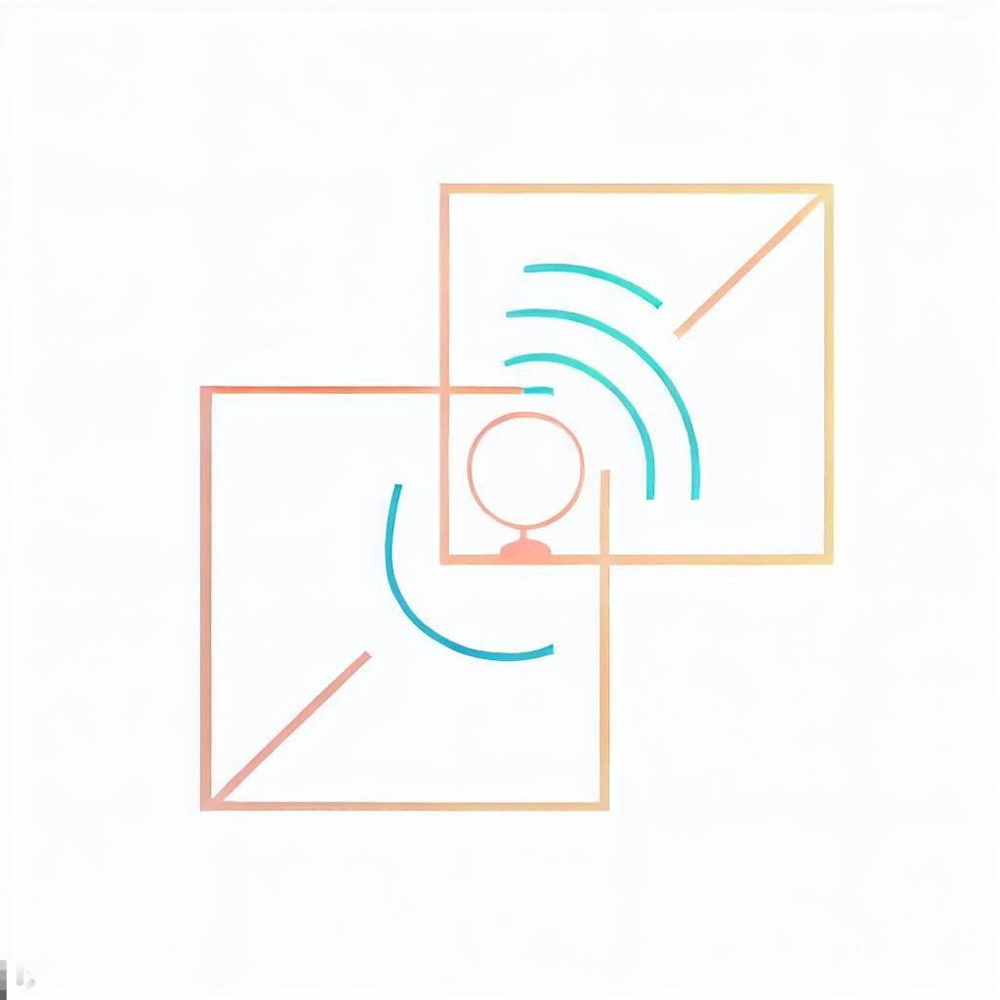

<p align="center">
    
</p>

# GF3Merger

GF3Merger is a simple tool for mergering adjacent GF3 images after coregistration in doris.

To expand the InSAR processing area of interests (AoI), it is sometimes neccessary to merge adjacent GF3 SLC images. This tool provides a simple way to achieve this. Please note, in oder to do this, the two images-to-be-merged must all be coregistered to the common master imagery in doris.

## Installation

### Download

```bash
git clone git@github.com:aprilab-dev/gf3merger.git
```

### Install Dependencies

Set up virtual environments

```bash
python3 -m venv $HOME/.venv/gf3merger
source $HOME/.venv/gf3merger/bin/activate
```

Installing dependencies

```bash
pip install --upgrade pip wheel  # wheel is required for setup.py
pip install -e .  # for this step to work you need to be inside gf3merger folder
```

## Example

An example is given in `example/example.py`.
